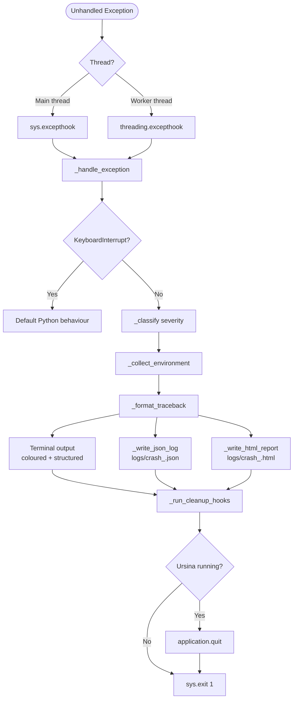

# Architecture

Date: 2026-03-26

CrashHandler is a centralised exception-handling subsystem for Ursina Engine projects in active development.
Rather than silently swallowing errors with try-except, it intentionally lets crashes propagate — but captures every detail before the process dies.

---

## Component Architecture



---

## Module Map

```
main.py                   ← entry point for the demo suite
src/
  crashhandler/
    crash_handler.py      ← single-file subsystem
    demo_suite.py         ← feature demonstration runner
    _demo_scenarios/      ← isolated scripts for the demo suite
logs/
  crash_<timestamp>.json  ← machine-readable structured log
  crash_<timestamp>.html  ← human-readable diagnostic report
```

---

## Key Systems

### 1. Global Crash Handler (`_handle_exception`)

Registered via `sys.excepthook`. Intercepts every unhandled exception on the main thread.
`KeyboardInterrupt` is forwarded to Python's default handler so Ctrl-C still works normally.

### 2. Thread Safety (`_patch_threading`)

`threading.excepthook` is patched at startup so exceptions raised on worker threads are routed through the same pipeline — preventing silent thread deaths.

### 3. Severity Classification (`_classify`)

`KeyboardInterrupt` on the main thread is forwarded to Python's default handler before `_classify` is called — it never enters the crash pipeline. On worker threads, `SystemExit` is silently swallowed by `_patch_threading` and also never reaches `_classify`.

| Severity    | Exception types                                                              |
|-------------|------------------------------------------------------------------------------|
| `FATAL`     | `MemoryError`, `RecursionError`, `SystemError`, any other `BaseException` subclass |
| `ERROR`     | All standard `Exception` subclasses                                          |
| `INTERRUPT` | `SystemExit` on the main thread only                                         |

### 4. Environment Snapshot (`_collect_environment`)

Captures at crash time:
- ISO timestamp
- Full Python version string
- OS / platform
- Current working directory
- `sys.argv`
- Active thread name

### 5. Log Outputs

**JSON log** — structured, machine-readable. Useful for automated parsing or future log-viewer tooling.

**HTML report** — dark-themed, human-readable. Opens directly in a browser. Colour-coded by severity. Intended to be the primary developer diagnostic artefact.

Both logs are written to disk before cleanup hooks are invoked. This guarantees that crash data is persisted even if a cleanup hook itself raises or hangs.

### 6. Cleanup Hooks (`register_cleanup_hook`)

Any subsystem can register a zero-argument callable:

```python
crash_handler.register_cleanup_hook(save_world_state)
```

Hooks run in registration order before the process exits. If a hook itself raises, it is skipped with a warning — the shutdown continues.

### 7. Ursina Integration

If `ursina` is importable, `application.quit()` is called before `sys.exit(1)`.
The subsystem degrades gracefully if Ursina is not installed.

---

## Usage

```python
# Example: root/main.py
from crashhandler.crash_handler import (
    setup_crash_handler,
    register_cleanup_hook,
)

setup_crash_handler()
register_cleanup_hook(autosave)

# ... rest of app startup
```

That's it. No try-except blocks required elsewhere in the codebase.
